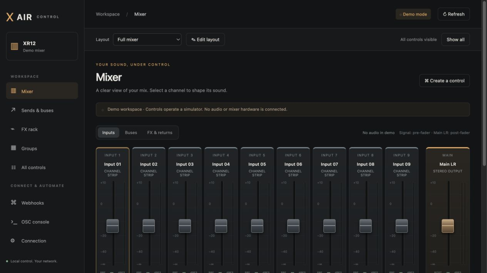

# X AIR Control

I built X AIR Control to run my mixer from a browser and trigger controls from a Stream Deck or Home Assistant. It runs in one Docker container, keeps its settings locally, and needs no cloud account.

The backend uses [xair-api-python](https://github.com/onyx-and-iris/xair-api-python). I support the library's XR12, XR16, XR18, and MR18 models, with live read-only hardware checks on an XR12. See [validation and limitations](docs/VALIDATION.md) for what I have actually tested.



## What it does

- Browser mixer with channel names, colors, faders, mute controls, and live signal meters.
- Bus workspace for input sends, EQ, dynamics, insert effects, and FX returns.
- FX rack with algorithm selection, insert mode, and return controls.
- Saved layouts to hide, reorder, and rename controls without changing the mixer.
- HTTP webhooks for buttons, automations, and custom interfaces.
- Full control catalog, raw OSC tools, and self-hosted API documentation.

I keep the interface login-free for trusted local networks. **Anyone who can reach the web port can control the mixer and manage webhooks.** I do not recommend exposing it directly to the internet.

## Requirements

I use Docker Engine or Docker Desktop with Docker Compose v2. The Docker host needs network access to the mixer. Initial builds also need access to GitHub, Docker Hub, and Python package indexes.

The Dockerfile builds for the host architecture; it does not force ARM64. I have tested ARM64 locally and AMD64 under Docker emulation. There is no published container image to pull: the following commands build one from source.

## Option 1: Docker Compose, building directly from GitHub

This is the simplest setup when I just want to deploy the app. I only need the Compose file; Docker downloads the source from GitHub during the build.

```sh
mkdir xair-control
cd xair-control
curl -fsSLo compose.github.yaml \
  https://raw.githubusercontent.com/DylanManiatakes/xair-control/main/compose.github.yaml

docker compose -f compose.github.yaml up -d --build
```

Open **http://localhost:8088** on the Docker host, or **http://YOUR_DOCKER_HOST:8088** from another device.

The standalone [compose.github.yaml](compose.github.yaml) uses this build context:

```yaml
build:
  context: "${XAIR_SOURCE:-https://github.com/DylanManiatakes/xair-control.git#main}"
```

Docker supports [Git repositories as build contexts](https://docs.docker.com/build/concepts/context/#git-repositories). `main` follows the branch at build time. To make a deployment reproducible, I set `XAIR_SOURCE` in `.env` to the same URL with an existing tag or full commit hash after `#`.

These GitHub commands require this repository to be published with a `main` branch containing the project files.

### Build from a local checkout instead

I use [compose.yaml](compose.yaml) when editing the project locally:

```sh
git clone https://github.com/DylanManiatakes/xair-control.git
cd xair-control
docker compose up -d --build
```

Both Compose files run the same app with the same security settings and a persistent `xair-data` volume. Use one deployment method at a time on a given port.

## Option 2: Docker build and docker run

I can also run it without Compose. First, build the image from GitHub:

```sh
docker build --pull -t xair-control:local \
  https://github.com/DylanManiatakes/xair-control.git#main
```

From a local checkout, the equivalent is `docker build --pull -t xair-control:local .`.

Then start the container:

```sh
docker volume create xair-control-data

docker run -d \
  --name xair-control \
  --restart unless-stopped \
  --publish 8088:8080 \
  --mount source=xair-control-data,target=/data \
  --read-only \
  --tmpfs /tmp \
  --cap-drop ALL \
  --security-opt no-new-privileges:true \
  xair-control:local
```

Open **http://YOUR_DOCKER_HOST:8088**. For host-only access, replace `--publish 8088:8080` with `--publish 127.0.0.1:8088:8080`.

## Connect your mixer

Every fresh installation starts in **Demo mode** with `127.0.0.1` as a placeholder.

1. Open **Connection** in the web interface.
2. Choose **Live mixer** and the correct mixer model.
3. Enter the mixer's address and UDP port, normally **10024**.
4. Select **Save & connect**.

Connecting validates the mixer identity; it does not upload demo values. The app then reads names and settings from the mixer. XR12W is recognized as an XR12. A failed connection keeps the previous configuration.

For everyday use, I start with [the controls and automation guide](docs/USAGE.md). The interactive API reference is at `/docs` on the running app.


## Ports, storage, and networking

The Container publishes only the web port. The container initiates OSC traffic to the mixer on UDP 10024; the network must allow its reply traffic. Bridge networking is the default, and no published UDP port is required.

For Compose, copy [.env.example](.env.example) to `.env` and adjust:

```dotenv
WEB_PORT=8088
BIND_ADDRESS=0.0.0.0
```

`0.0.0.0` listens on the host's interfaces. Use `127.0.0.1` when only the Docker host or a local reverse proxy should reach the app. If the mixer is on another VLAN, the host needs a route and appropriate firewall rules.

The container runs as user ID **10001**, drops Linux capabilities, and uses a read-only root filesystem. `/data` stores `settings.json`, `hooks.json`, and `layouts.json`; `/tmp` is temporary. Compose names the volume using the project/stack name, usually `xair-control_xair-data`. The `docker run` example uses `xair-control-data`.

**ONE app instance and one backend worker per configuration**. The process owns the mixer session and JSON storage. Multiple browser clients can use that instance. Recent activity and demo mixer values reset on restart; saved connections, layouts, and hooks persist.

## Updates, backups, and moving servers

For the GitHub Compose installation:

```sh
docker compose -f compose.github.yaml build --pull
docker compose -f compose.github.yaml up -d
```

For a local checkout, run `git pull`, then `docker compose up -d --build`. For `docker run`, rebuild the image, stop and remove the old container, then repeat the run command using the **same named volume**.

Back up the `/data` volume before updates or migration. Stop the app for a consistent copy, archive the volume with the Docker host's backup tooling, and restore it into the new deployment's data volume. Preserve file ownership, or make restored files writable by UID 10001.

`docker compose down` keeps the data volume. **`docker compose down -v` removes it.** Changing the Compose project or Portainer stack name can create a new, empty volume.

When moving servers, update Stream Deck or Home Assistant URLs to use the new Docker host. Restoring the data preserves webhook tokens. Hooks are also bound to the mixer model, mode, and live connection target; recreate them if that target changes.

## Troubleshooting

| What I see | What I check |
| --- | --- |
| GitHub build fails | The repository and `main` branch exist, and the Docker builder has internet access. |
| Web page does not open | `docker compose -f compose.github.yaml ps`, the published port, and the host firewall. |
| Web page works but mixer does not respond | Mixer address, model, power, routing/VLAN rules, and UDP 10024 reply traffic. |
| Container is healthy but mixer is offline | `/health` checks the web server; `/api/status` reports mixer connectivity. |
| Controls show unavailable | The mixer may not expose that property on that model/channel, or its read timed out. |
| Meters are blank | Demo has no audio telemetry; live meters also clear when their data becomes stale. |
| Settings disappeared | The deployment may be using a new project name or an empty data volume. |

Use `docker compose -f compose.github.yaml logs --tail=100 xair`, or `docker logs --tail=100 xair-control` for the `docker run` installation. Before sharing logs or screenshots, remove mixer addresses, personal names, and webhook URLs.

## Development and tests

```sh
python3.12 -m venv .venv
.venv/bin/pip install -r requirements-dev.txt
.venv/bin/python -m pytest -q
```

Isolated demo stack for the container smoke test so it cannot change a live mix:

```sh
BIND_ADDRESS=127.0.0.1 WEB_PORT=18088 \
  docker compose -p xair-smoke up -d --build

python3 scripts/smoke.py --base-url http://127.0.0.1:18088 \
  --project-name xair-smoke

# Remove only this disposable test stack and its demo data.
docker compose -p xair-smoke down -v
```

The backend is FastAPI; the frontend is plain JavaScript/CSS with no Node build step. Runtime Python packages are pinned in `requirements.lock`.  See [validation](docs/VALIDATION.md) for the testing boundary and [third-party notices](THIRD_PARTY_NOTICES.md) for dependencies and references.

## License

This project is released under the [MIT license](LICENSE). Anyone may use, modify, distribute, sublicense, and sell it, provided the copyright and license notice are retained. It comes without warranty.

This is an independent project, not an official Behringer or Midas application.
